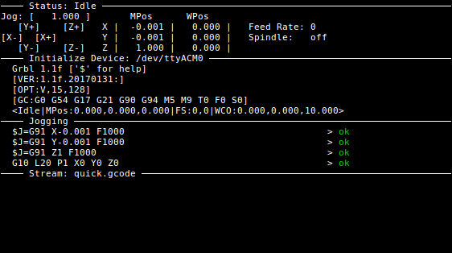
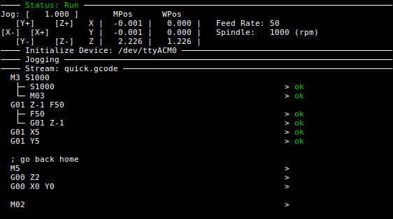
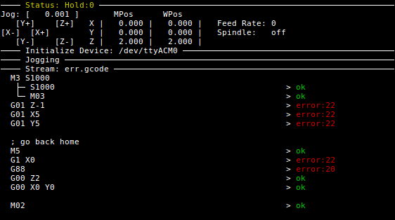

# grbl-stream

Command-line GRBL streaming script

**Focus**

The primary focus for `grbl-stream` is a **robust** link from the intended tool path to your CNC machine.

This project started with my CNC machine occasionally returning errors on gcodes
unpredictably, then continuing with the next g-code... so I thought... "can't
the software figure this out for me!?".

With simple streamers, no, it can't, but I think I can do it... thus `pygcode`
and `grbl-stream` was born. (also: I was unemployed, bored, and sick of playing
games, so that helped)

**Limitations**

- a bit buggy at the moment (currently in pre-alpha), which is directly contrary to the primary vision for this streamer.
- won't work on Windows as is (`TODO`: there's a `curses` port for _MS DOS emulation_ (or whatever it's evolved into) called `UniCurses` which may work without much effort)

# Install

Install using `pip`

    pip install grbl-stream

or install directly from PyPi website: https://pypi.python.org/pypi/grbl-stream

# Usage

## Jogging

It starts off in a _jogging_ state with keys:

    ; Jogging Keys                                                                
    ;    - Arrow Keys: X/Y axes                                                   
    ;    - PgUp/PgDn: Z axis                                                      
    ;    - []: increase/decrease jog distance                                     
    ;    - Space: zero work offsets (all axes)                                    
    ;    - x,y,z: zero individual axis                                            
    ;    - Enter: start streaming gcode                                           

Machine's mode is changed to incremental `G91` if jogging is requested, then reverted back to the initial mode when finished.

## Streaming

When user presses `[enter]` script switches state to streaming gcode over serial

in both _jogging_ and _streaming_ states, gcode on screen indicates gcode progress with:

    G00 Z2       > ok       line sent, GRBL responded with 'ok'
    (comment)               displayed, but no action taken
    G00 X10      >          line sent, no response received (yet)
    G00 Y-10                line not sent yet

script continues streaming / checking status until:

- all lines have been sent
- all responses have been received from GRBL
- finally: machine's state is `Idle` (ensures CNC machine has completed tool path)

### Error Handling

If an error is returned in response to a streamed line, the `!` halt command is
immediately sent.

TODO: at the time of writing this, the script is unrecoverable, it just stops
mid stream in the halted state (press _ctrl+C_ to exit)

## Command Line

running `grbl-stream --help` displays the help text...

    usage: grbl-stream [-h] [--settings SETTINGS_FILE] [--version] [--keep-open]
                       [--nojog] [--split-gcodes] [-d SERIAL_DEVICE]
                       [-b SERIAL_BAUDRATE] [--logfile LOG_FILE]
                       [infile]

    GRBL gcode streamer for CNC machine. Assist jogging to position, then stream
    gcode via serial.

    positional arguments:
      infile                gcode file to stream, to use stdin specify as '-'
                            (default: -). WARNING: If stdin (-) is used,
                            interactive jogging is disabled

    optional arguments:
      -h, --help            show this help message and exit
      --settings SETTINGS_FILE, -s SETTINGS_FILE
                            settings json file (default: /home/nymphii/.grbl-
                            stream.json)
      --version, -v         display grbl-stream version and exit

    Streaming Actions:
      --keep-open, -o       if set, window won't close when job is done
      --nojog               bypass jogging state; jump straight into streaming
                            (note: this is always set if input is stdin)
      --split-gcodes        multiple gcodes per line will be split and streamed in
                            order of execution

    Serial Connectivity:
      -d SERIAL_DEVICE, --device SERIAL_DEVICE
                            serial device GRBL is connected to, can use direct
                            device name (eg: /dev/ttyACM0) or the Arduino's serial
                            number (eg: 55639303235351C071B0)
      -b SERIAL_BAUDRATE, --baudrate SERIAL_BAUDRATE
                            serial baud rate

    Debug Parameters:
      --logfile LOG_FILE    if given, data read from, and written to serial port
                            is logged here (note: \r and \n characters are escaped
                            for debugging purposes)

# Running on remote system (eg: Raspberry Pi)

GRBL streaming will only be successful while the streaming process is allowed to
remain active (obviously, a program stops when the OS kills it).

When running on a remote system (via something like
`ssh` or `telnet`) you can keep the remote process alive by using
`tmux` or `screen`.

Starting streaming with `tmux` or `screen` will protect the GRBL stream from
issues like power-failure on your local machine, or a simple network failure.

(this is also true for any remote process... so it's generally good practice)

**`screen`**

    # on your local machine
    $ ssh pi@192.168.1.123 # or whatever

    # on machine connected to GRBL programmed device (say a Raspberry Pi)
    $ screen -Rx || screen -l
    # opens a screen session (or joins to an existing one)
    $ grbl-stream file.gode

**`tmux`**

    # on your local machine
    $ ssh pi@192.168.1.123 # or whatever

    # on machine connected to GRBL programmed device (say a Raspberry Pi)
    $ tmux attach || tmux
    # opens a tmux session (or attaches to an existing one)
    $ grbl-stream file.gode
